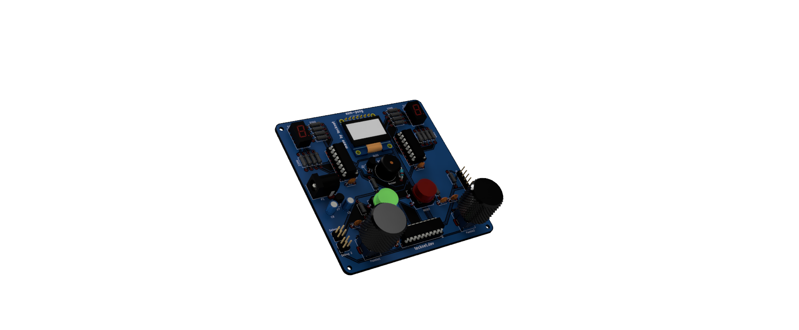
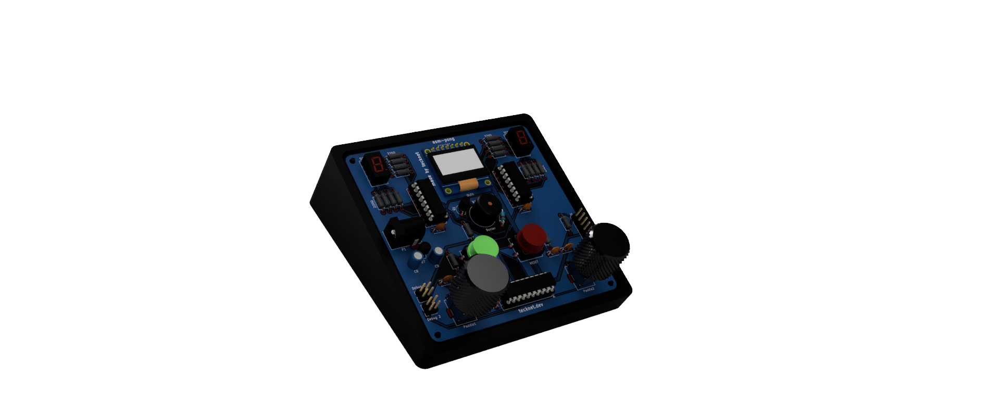

<div align="center">

  <h1>asm-pong</h1>

  <p>pong implemented in assembly!</p>

<p align="center">
  
</p>

</div>

## What!?

Basically what the subheading said! The classic game of pong implemented in assembly, running on a PIC16F18346 based console(-ish).

The PIC16F18346 console boasts a whopping 2KB of RAM, and a massive 28KB of flash memory, clocked at a blazing 32MHz! The game is displayed on a 128x64px OLED screen, with the player paddles being controlled by two potentiometers. Scores are displayed on two dedicated seven segment displays, with the sound effects being generated by a singular active buzzer. The console uses 3.3V, supplied by a regulated (up to 6V) power supply. Also features a dedicated ICSP header for easy programming using a PICkit3 or similar. 

## Hardware Overview
- PIC16F18346: Enhanced 8 bit, 20 pin mid-range PIC
- SSD1306: 128x64 pixel SPI OLED screen
- Alps RK09: Input potentiometers
- MCP1700-3302E: 3.3V regulated input
- 74HC595N: Daisy chained shift registers
- LD3161-AS: 0.36" red seven segment displays

## BOM

The detailed bill of materials file can be found under [pcb/production/bom.csv](pcb/production/bom.csv). All the components were sourced from AliExpress besides the PIC, since LCSC has much better pricing for the same. The table is reproduced below for convenience.

>[!Note]
> The capacitor and resistor pricing is the entire bundle price, including all the required values for this project.


| Item                       | Quantity | Description              |  Price | Source                                                                                                                                                                                                  |
| -------------------------- | -------: | ------------------------ | -----: | ------------------------------------------------------------------------------------------------------------------------------------------------------------------------------------------------------- |
| PIC16F18346-I/P            |        1 | Microcontroller          |  £1.81 | [LCSC](https://www.lcsc.com/product-detail/C647086.html?s_z=n_q_pic16f18346&spm=wm.fly.bg.0.xh&lcsc_vid=RFZZAwJQR1YIUFFXEgMNVgdQQAUIAQEER1IKUlZfRlcxVlNeQFhfXlBeRFFcVTsOAxUeFF5JWBYZEEoKFBINSQcJGk4%3D) |
| 100nF Ceramic Capacitor    |        7 | Decoupling capacitor     |      £1.93 | [AliExpress](https://www.aliexpress.com/item/1005008244407175.html?spm=a2g0o.order_list.order_list_main.203.33291802JVuyPM)                                                                             |
| 1µF Electrolytic Capacitor |        2 | Bulk capacitor           |      £1.96 | [AliExpress](https://www.aliexpress.com/item/1005006244064108.html?spm=a2g0o.order_list.order_list_main.316.33291802JVuyPM)                                                                             |
| SSD1306                    |        1 | OLED screen              |  £2.33 | [AliExpress](https://www.aliexpress.com/item/1005006379964006.html?spm=a2g0o.order_list.order_list_main.180.33291802JVuyPM)                                                                             |
| SN74HC595                  |        2 | Shift registers          |  £0.80 | [AliExpress](https://www.aliexpress.com/item/32796581727.html?spm=a2g0o.order_list.order_list_main.163.33291802JVuyPM)                                                                                  |
| LD-3161-AS                 |        2 | Seven-segment display    |  £2.33 | [AliExpress](https://www.aliexpress.com/item/1005007531476613.html?spm=a2g0o.order_list.order_list_main.158.33291802JVuyPM)                                                                             |
| Tactile Buttons            |        2 | Push buttons             |  £1.16 | [AliExpress](https://www.aliexpress.com/item/1005010485096642.html?spm=a2g0o.order_list.order_list_main.138.33291802JVuyPM)                                                                             |
| RV09 Potentiometers        |        2 | Potentiometers           |  £1.08 | [AliExpress](https://www.aliexpress.com/item/4000665266312.html?spm=a2g0o.order_list.order_list_main.128.33291802JVuyPM)                                                                                |
| Buzzer                     |        1 | Active buzzer            |  £1.80 | [AliExpress](https://www.aliexpress.com/item/1005010321957502.html?spm=a2g0o.order_list.order_list_main.80.33291802JVuyPM)                                                                              |
| 2N2222 NPN                 |        1 | Buzzer transistor        |  £1.00 | [AliExpress](https://www.aliexpress.com/item/1005005776372882.html?spm=a2g0o.order_list.order_list_main.68.33291802JVuyPM)                                                                              |
| 1N4148 Diode               |        1 | Flyback diode            |  £1.00 | [AliExpress](https://www.aliexpress.com/item/1005008512103805.html?spm=a2g0o.order_list.order_list_main.50.33291802JVuyPM)                                                                              |
| Knurled Metal Tone Knob    |        2 | Potentiometer knob       |  £2.01 | [AliExpress](https://www.aliexpress.com/item/1005002748625431.html?spm=a2g0o.order_list.order_list_main.35.33291802JVuyPM)                                                                              |
| MCP1700-3302E/TO           |        1 | 3.3V LDO                 |  £2.39 | [AliExpress](https://www.aliexpress.com/item/1005012279859529.html?spm=a2g0o.order_list.order_list_main.17.33291802JVuyPM)                                                                              |
| DC Power Barrel            |        1 | VIN input                |  £1.00 | [AliExpress](https://www.aliexpress.com/item/1005003329078538.html)                                                                                                                                     |
| 220Ω THT Resistor          |       16 | Current limiting         | £2.69|[AliExpress](https://www.aliexpress.com/item/1005007714306585.html?spm=a2g0o.order_list.order_list_main.98.74b31802kVDw05)                                                                                                                                                                                                       |
| 10kΩ THT Resistor          |        3 | RC/MCLR pull-up          |      £2.69|[AliExpress](https://www.aliexpress.com/item/1005007714306585.html?spm=a2g0o.order_list.order_list_main.98.74b31802kVDw05)                                                                                                                                                                                                     |
| 1kΩ THT Resistor           |        1 | Transistor base resistor |    £2.69  | [AliExpress](https://www.aliexpress.com/item/1005007714306585.html?spm=a2g0o.order_list.order_list_main.98.74b31802kVDw05)                                                                                                                                                                                                       |
| PICkit 3                   |        1 | ICSP programmer          | £14.19 | [AliExpress](https://www.aliexpress.com/item/1005007470418989.html?spm=a2g0o.order_list.order_list_main.168.33291802JVuyPM)                                                                             |
| PCB                        |        5 | Custom PCB               |     ~   | [pcb/production](pcb/production)                                                                           |


## Schematic


## PCB


## Assembly

PCB production files can be found under [pcb/production](pcb/production). Board is under 100x100mm, so should cost less than $5 for five boards from either [PCBWay](https://www.pcbway.com/) or [JLCPCB](https://www.jlcpcb.com/). I personally sourced them from JLC. All components are THT, so they should be very easy to solder. Follow the component references as given by the [schematic pdf](assets/schematic.pdf). Its a straightforward assembly, there isn't much else to say!

The case can be found in the [case](case/) directory. The taper angle is 15º, so I would recommend printing the model angled at 15º such that the top face is parallel to the bed, with ironing turned on for the best finish. PLA is the recommended material. 

With the case printed, the PCB mounts using the M2 mounting holes. No extra hardware needed, it just slots into the case. The case also has small indents in the bottom for rubbery grips. Just fill the indents with hot-glue, then overfill the indent very slightly to make a rubber grip. 

<p align="center">
  
</p>

## Modifying source code

If you would like to make your own changes to the source code, you'll obviously have to recompile to get the new .hex! To get you started on that, here are a few recommendations.

First, I would lean towards using VSCode over MPLABX IDE. VSCode does require a fair bit more setup, over MPLABX, which is just plug and play, but in my opinion, the overall developer experience is worth that effort, since you get access to all of VSCode's quality of life features.

If you end up using VSCode, you'll need to install the MPLAB extension pack. Using the MCC that comes installed with this pack, you can configure your config bits and such. With that, you then set the compiler to PIC Assembly (PIC-AS/XC8). I would also then recommend you make a custom build task in ```.vscode/task.json```, similar to this:

```json
{
    "version": "2.0.0",
    "tasks": [
        {
            "label": "Build PIC HEX",
            "type": "shell",
            "command": "cmake --build _build/asm-pong/default && cp $(find out -name '*.hex' | head -n 1) out/output.hex",
            "group": {
                "kind": "build",
                "isDefault": true
            },
            "problemMatcher": [],
            "presentation": {
                "echo": true,
                "reveal": "always",
                "focus": false,
                "panel": "shared",
                "showReuseMessage": false,
                "clear": false
            }
        }
    ]
}
```

Hitting the build shortcut will then produce the ```output.hex``` that you can then flash. 

If you choose to go down the MPLABX IDE, all the build tasks and such should work natively without any setup. You also have easier access to the simulators and such. 

## Flashing firmware

To flash the firmware to the PIC, you need to use the ICSP header. The easiest way to flash the firmware is with a PICkit3 or above, and the [MPLAB IPE Software](https://www.microchip.com/en-us/tools-resources/develop/mplab-x-ide) (you may have to install the PIC16F1xxxx pack manually).
> [!NOTE]
> MPLAB IPE support for legacy PICkits (2 and 3) was dropped after v6.20. These PICkits are cheaper to purchase, and work just fine for this use case. To use with MPLAB IPE, install v6.20 or prior. My PIC was flashed with a PICkit3 using MPLAB IPE v6.00. Alternatively, you can use a terminal utility like ```ipecmd```, ```pkcmd-lx``` or similar. 

> [!NOTE]
> You can also flash the PIC by bit banging the ICSP protocol on another microcontroller. You do not need a level shifting circuit since Low Voltage Programming should be supported by the PIC16F18346. This has NOT been verified.

Assuming you're using a PICkit with MPLAB IPE, select the PIC16F18346 under devices, and your tool in the tool selection menu. If the software isn't detecting your PICkit, unplug it, hold down the button, then plug it back in, keeping the button pressed for a few more seconds. Then double check if is being detected as connected to a port on your system information panel. Once you have it connected, enable the advanced mode (under Settings > Advanced Mode). With this enabled, you should see various settings appear on the sidebar. Go to the power setting, and tick the box saying "Power target circuit from PIC". Ensure the PIC16F18346 (and the console by extension), is powered by 3.3V before proceeding.

>[!NOTE]
> If you can't see the PIC under the device options, you probably don't have the pack installed and linked. [Download](https://packs.download.microchip.com/Microchip.PIC16F1xxxx_DFP.1.31.465.atpack) the pack here. Locate the ```.mchp_packs``` directory, and drop the file in there. 

>[!WARNING]
> If you fail to check "Power target circuit from PIC", you may damage either the PICkit, or the PIC itself. Double check this setting is enabled, and read the output logs as the PICkit connects to the PIC. 

With all that setup, plug in the PICkit's headers into the ICSP header on the board. The top pin of the header (pin closest to the screen) is MCLR. Match that with the pinout of your PICkit. Now download and load the [.hex](out/output.hex) file into the IPE, and click program. Et voila, you should have a fully programmed PIC!

>[!NOTE]
> If you see glitchy behaviour, or the screen not starting up, make sure the PCB is disconnected from the programmer. When the headers are still connected, it behaves oddly. After that, hit the reset button to re-boot the PIC. 

## Demo

A demo video of an entire game being played out can be found on my [YouTube channel](https://www.youtube.com/watch?v=OH-_ZXIoXKA). Here is a picture of the completed build!


